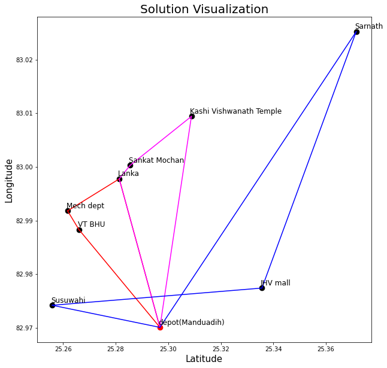

# Capacitated-VRP-with-Split-Delivery (CSDVRP)

[](https://github.com/Siraj-Adil/Capacitated-VRP-with-Split-Delivery)


## Overview

This software project provides a solution to the **Split Delivery Vehicle Routing Problem (SDVRP)**, a variant of the classical **Vehicle Routing Problem (VRP)** where each customer can receive goods from more than one vehicle. The solution aims to minimize the total travel cost or distance traveled by all vehicles while ensuring that each customer's demand is satisfied.

## Technologies & Tools

-   **Python** – Core language for modeling and analysis
-   **PuLP** – MILP modeling
-   **Gurobi** – High-performance MILP solver (switch to CBC solver for open-source)
-   **Pandas** – Data handling & preprocessing
-   **Matplotlib** – Route visualization

## Features

The CSDVRP Solver includes the following features:

1. Input data parsing from two CSV files :
   a) Time Matrix
   b) Location coordinates and its Demand.

2. A User input Cell allowing user to change :
   a) Starting depot
   b) Number of Vehicles in fleet
   c) Capacity of each Vehicles

3. Output contains the information:
   a) The optimal vehicle routes
   b) Total travel time
   c) Demand catered of location by particular vehicle (This has been saved in a csv file)

## Setup Instructions

To use the CSDVRP Solver, follow these steps:

1. Clone the repository:

```bash
git clone https://github.com/Siraj-Adil/Capacitated-VRP-with-Split-Delivery.git
cd Capacitated-VRP-with-Split-Delivery
```

2. Install dependencies:

```bash
pip install -r requirements.txt
```

3. Prepare your input data in two CSV file(s) (
   a) With the following columns: Location Name, x_coordinate, y_coordinate, Demand
   b) Time matrix or Distance matrix

4. Run Jupyter Notebook and import your csv file

```bash
jupyter notebook CSDVRP_Model.ipynb
```

5. Check the output data file generated in the same folder as the input file, named Output_data_timestamp.csv

## Results



## Contributors

This project was developed by Siraj Adil as a Course Assignment for the Network Flows and Graphs course at Indian Institute Of Technology (BHU), Varanasi for M.Tech Degree in subject Decision Sciences and Engineering. Contributions, feedback, and suggestions are welcome through GitHub Issues and Pull Requests.
